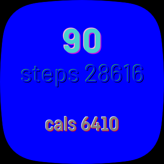

# shadow-text
Widget for 3D effects on textElements for fitbit OS\
(instruction and usage doco will follow soon...)

!

## WORK IN PROGRESS...

Each widget instance contains 3 sub Elements:

WIDGET-INSTANCE:

Properties:

x,y,letterspacing,text
style: 
all font-attributes, opacity, display

Additionally: 

main, light, shadow
___
SUBELEMENTS:

(main, light, shadow)

Properties in general: 
* x, y, style: fill, opacity, display (to perhaps "mute" one of them)

Specific:

main: 
* x,y are fixed to x,y of the widget-instance (changes here get overwritten in widget)
* textAnchor gets applied here like: el.main.textAnchor

light, shadow:  
* x,y for offset to main
---
Position of the whole widget instance gets set on el.x, el.y
also opacity/display can be applied directly (el.style...)

---
The widget elements have default settings which can be overritten in resources/CSS using id/class
also changes on those properties in index.view via set or in index.js are supported                          

This widget gets integrated by the widget-factory written by [Gondwanasoft](https://github.com/gondwanasoft/fitbit-simple-widget)

