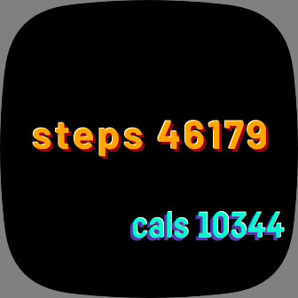

# CSS currently broken... (working on it)
# shadow-text
Widget for shadow-/highlight effects on textElements for fitbit OS\
(instruction and usage doco will follow soon...)

WORK IN PROGRESS...
Each textElement contains actually 3 elements: main, light and shadow.

These elemts can be used to create a 3D effect on text.

text.light and text.shadow can have their own color and opacity.

Their x and y define their offset to the text.main.

Text and text-properties are the same for all 3 text-elements.

!

This widget gets integrated by the widget-factory written by [Gondwanasoft](https://github.com/gondwanasoft/fitbit-simple-widget)

